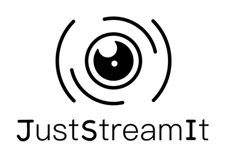

JustStreamIt is a french web platform aimed at sharing movies rankings.

> Tu ne sais pas quoi regarder pour passer une bonne soirée ? Alors JustStreamIt !

---

## Installation

### Steps
1. Clone the project.
2. Create the python environment.
3. Run the API server.


### 1/ Clone the project
```
$ git clone --recursive https://github.com/evrard1301/just-stream-it.git
$ cd just-stream-it
```

### 2/ Create the python environment
```
$ python -m venv env
```

*Note: the virtual environment **must** be named ``env`` (otherwise the script run_api.sh won't works).*


### 3/ Run the API server
#### Using the run_api.sh helper script
```
$ chmod +x scripts/run_api.sh
$ scripts/run_api.sh
```
*Note: the run_api.sh script must be executed from the project root directory.*

####  OR Manually using pip
```
$ source env/bin/activate
$ cd thirds/OCMovies-API-EN-FR
$ pip install -r requirements-dev.txt
$ ./manage.py create_db
$ ./manage.py runserver
```

####  OR Manually using pipenv
```
$ source env/bin/activate
$ cd thirds/OCMovies-API-EN-FR
$ pipenv install
$ pipenv run python manage.py create_db
$ pipenv run python manage.py runserver
```

For more informations see the [github API documentation](https://github.com/OpenClassrooms-Student-Center/OCMovies-API-EN-FR/blob/master/README.md).
